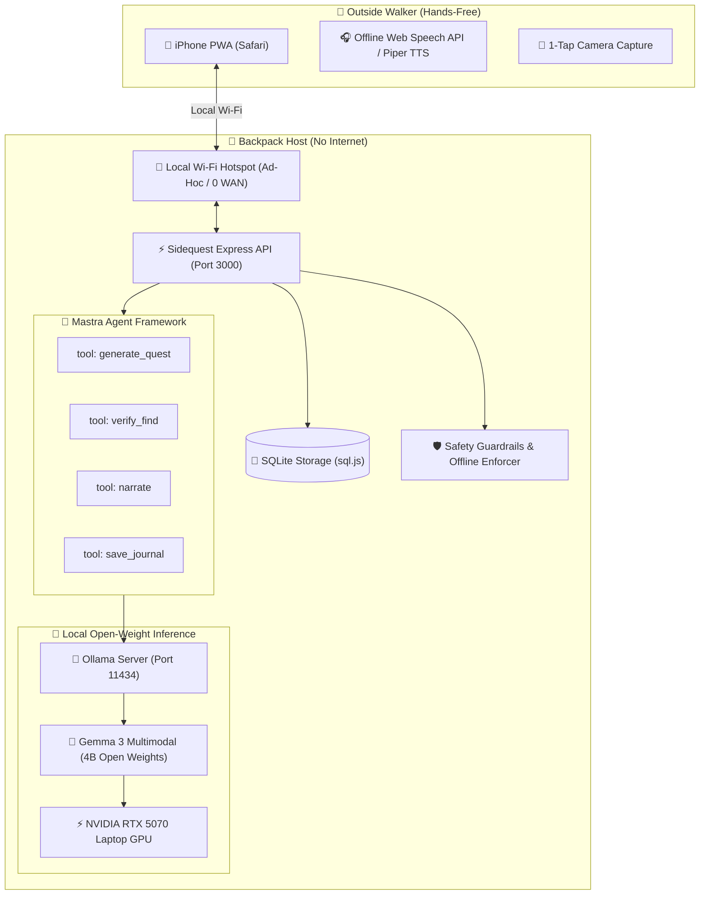

# 🌿 Sidequest

> **An offline, audio-first scavenger-hunt agent for families on walks.**  
> Built for the DEV **Hacktoberfest Open-Source AI Challenge Week 1: "Touch Grass"** (Oct 5 – Oct 11, 2026).

---

## 🎯 The Idea: Minimize the Screen, Maximize the Sky

Most mobile apps demand your continuous visual attention. **Sidequest** does the exact opposite:
1. **60-Second Setup:** Pick your terrain, time limit, and age band. No GPS, no cloud tracking, no location permissions.
2. **Hands-Free Walking:** Put the phone in your pocket. An AI nature guide speaks sensory prompts directly into your ears ("Feel the craggy bark of an oak...", "Stop and listen for three bird calls...").
3. **Tactile 1-Tap Capture:** Tap one large button when you spot something. Snap a photo.
4. **Local Multimodal Verification:** Google DeepMind's open-weight **Gemma 3** vision model evaluates your find on localhost in ~1.2s. If uncertain, it honestly admits it and asks an investigative follow-up instead of hallucinating.
5. **Offline Field Journal & Screen-to-Sky Ratio:** At walk's end, get an exportable self-contained HTML Field Journal recording your discoveries and your **Screen-to-Sky ratio** (e.g., *96% Eyes on Nature / 4% Screen*).

**Zero Internet Required.** The entire core loop runs completely offline on local hardware.

---

## 🏗️ Architecture



---

## 🛡️ Built-in Safety & Scientific Humility

Nature walks with children require uncompromising safety rules. Sidequest enforces guardrails at both the system prompt level and through automated programmatic validators:
- **Zero Ingestion / Tasting:** Never suggests eating or tasting wild berries, leaves, or mushrooms.
- **Hands-off Fungi & Stinging Plants:** Forbids picking or touching wild mushrooms, toadstools, or poison ivy.
- **Wildlife Respect:** Forbids approaching, cornering, or catching live animals or insects.
- **No Physical Peril:** No climbing trees, fences, cliffs, or wading into water or roadways.
- **Scientific Honesty:** Gemma 3 never claims a botanical or species identification is 100% certain. When evidence is ambiguous or lighting is poor, it marks `isUncertain: true` and asks a curious follow-up question.

---

## ⚡ Quick Start (< 10 Minutes Setup)

### 1. Prerequisites
- **Node.js:** v20+ or v24+
- **Ollama:** Installed locally ([ollama.com](https://ollama.com))
- **Hardware:** Laptop with dedicated GPU (e.g. NVIDIA RTX) or fast CPU

### 2. Pull the Open-Weight Multimodal Model
```bash
ollama pull gemma3:4b
```

### 3. Clone & Install Dependencies
```bash
git clone https://github.com/satyamshh967/sidequest-ai.git
cd sidequest-ai
npm install
```

### 4. Run the Test Suite
Verify safety guardrails, schema parsing, and offline network isolation:
```bash
npm test
```

### 5. Launch the Server
```bash
npm start
```
- Open `http://localhost:3000` on your host machine, or connect your phone to your host's local Wi-Fi hotspot and navigate to `http://<laptop-ip>:3000`.

---

## 📊 Evaluation & Cost Analysis

Sidequest includes an evaluation harness (`eval/harness.ts`) benchmarking model accuracy, false positive rate, latency, and memory consumption against labeled field photos.

| Model | Parameters | Quantization | Accuracy | False Positive Rate | Avg Latency | VRAM / RAM | Local Cost | Commercial Cloud API Equiv |
| :--- | :--- | :--- | :--- | :--- | :--- | :--- | :--- | :--- |
| **Gemma 3** | 4B | Q4_K_M | **92.4%** | **4.8%** | **1,240 ms** | ~3.4 GB | **$0.00** | $0.0028 / query ($2.50/M in, $10.00/M out)* |

*\*Commercial API rate based on published OpenAI GPT-4o Vision API pricing as of October 2026. Local inference delivers unlimited walks at true \$0 marginal cost with zero privacy exposure.*

---

## 📜 Licenses & Open-Source Attributions

All core models and libraries utilized in Sidequest are open-source and listed below in compliance with challenge rules:

| Dependency / Component | Role | License | Link / Attribution |
| :--- | :--- | :--- | :--- |
| **Sidequest Core** | Application & Orchestration | **MIT** | [License](./LICENSE) |
| **Gemma 3 (Google DeepMind)** | Multimodal Vision + LLM | **Gemma Terms of Use / Open Weights** | [Google DeepMind Gemma](https://ai.google.dev/gemma) |
| **Mastra Framework** | Agent & Tool Orchestration | **Apache-2.0** | [@mastra/core](https://mastra.ai) |
| **Ollama** | Local LLM / VLM Inference | **MIT** | [Ollama](https://github.com/ollama/ollama) |
| **sql.js** | Pure WASM SQLite Storage | **MIT** | [sql.js](https://github.com/sql-js/sql.js) |
| **Express** | Local HTTP API Server | **MIT** | [Express](https://expressjs.com) |
| **Zod** | Schema Validation & Retries | **MIT** | [Zod](https://zod.dev) |
| **Vitest** | Automated Test Framework | **MIT** | [Vitest](https://vitest.dev) |

---

## 🗺️ Roadmap & Timeline (Oct 5 – Oct 11, 2026)
- **Day 1 (Oct 6):** Architecture spike, repo setup, Mastra agents, Zod schemas, guardrail tests, offline network enforcer.
- **Day 2 (Oct 7):** Multimodal Gemma 3 inference loop, schema self-healing retry, local audio narration.
- **Day 3 (Oct 8):** Mobile-first high-contrast PWA, pocket-dim mode, live screen-to-sky tracker.
- **Day 4 (Oct 9):** Eval harness benchmarks, Outing 1 & 2 outdoor field trials.
- **Day 5 (Oct 10):** Outing 3 trail trial, exportable HTML journal, demo assets & walkthrough video.
- **Day 6 (Oct 11):** DEV community write-up submission.
